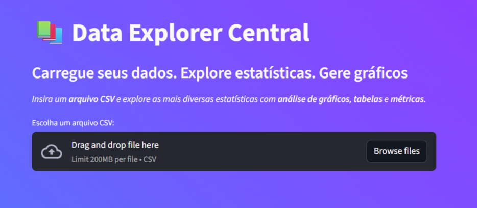
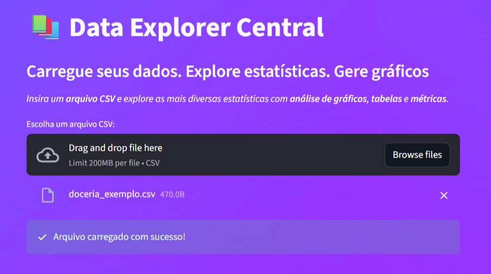
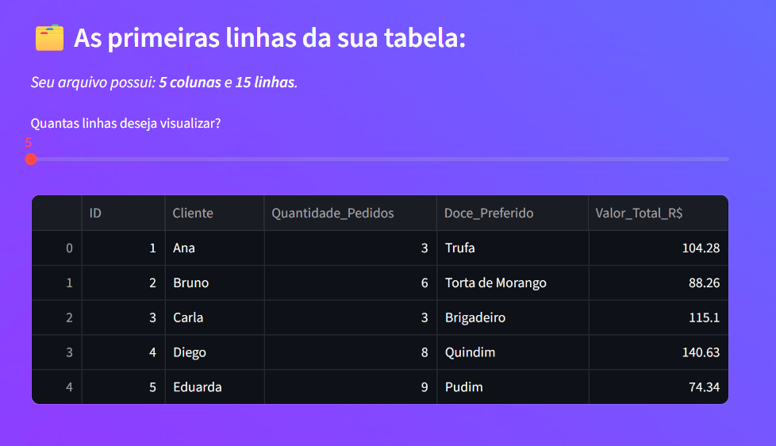
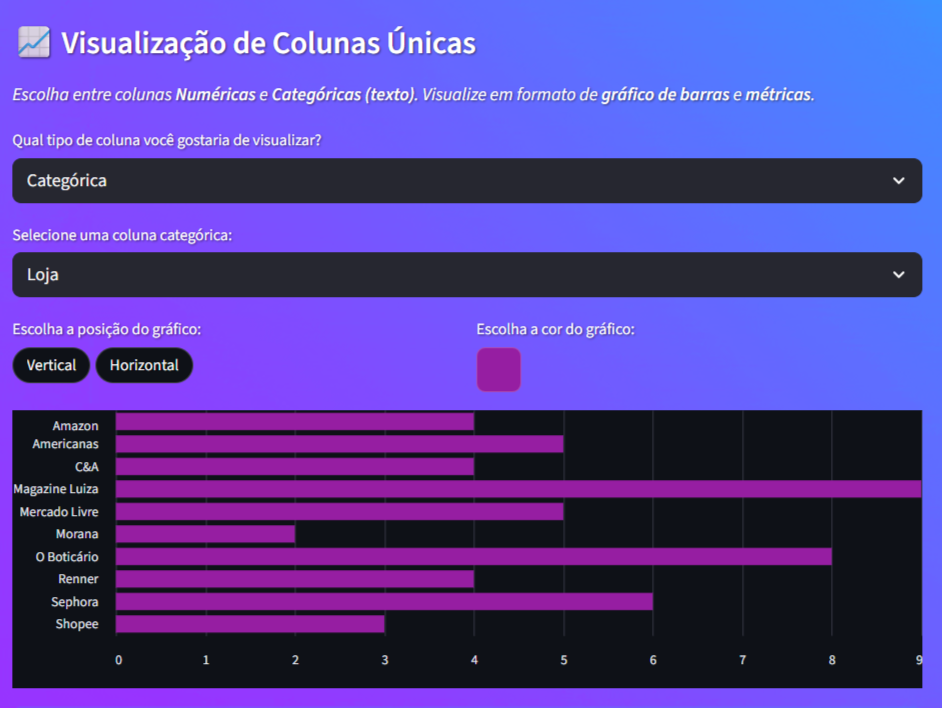
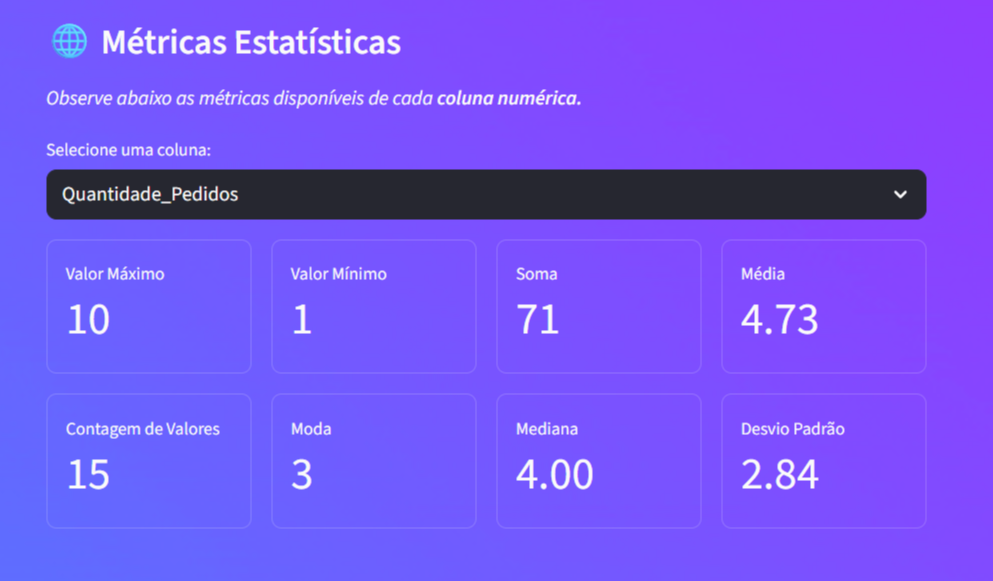
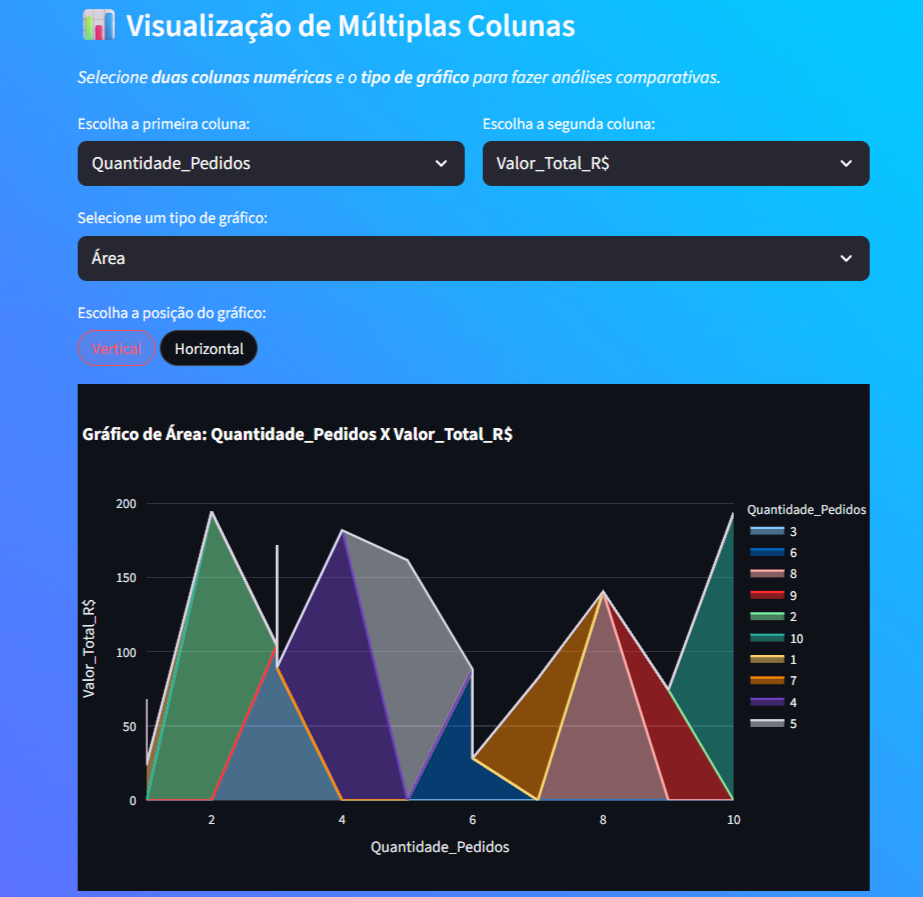

# 📚 Data Explorer Central

<!--------------- 📍 Introdução -------------->
## 📍 Introdução
> **Projeto autoral** de uma aplicação web desenvolvido em **Python** para **explorar, visualizar e analisar arquivos CSV** de forma simples e interativa. Com este app, é possível **carregar dados**, **gerar estatísticas descritivas** e criar diferentes tipos de **gráficos personalizáveis** sem escrever código. **Link para acessar o site fixado na descrição do repositório!**

 

<!----------- 📁 Sumário ---------->
## 📁 Sumário
- [▶︎ Explicação do Projeto](#explicação-do-projeto)
- [▶︎ Funcionalidades](#funcionalidades)
- [▶︎ Requisitos](#requisitos)
- [▶︎ Estrutura do Projeto](#estrutura-do-projeto)
- [▶︎ Imagens do Projeto](#imagens-do-projeto)
  

 

<!--------------- 🌐 Explicação do Projeto -------------->
## <a id="explicação-do-projeto">🌐 Explicação do Projeto</a>
> Desenvolvi este projeto para auxiliar em análises de dados para fácil acesso a informações básicas, sem precisar digitar linhas de código. Esta aplicação foi feita através da biblioteca `Streamlit` que permite a integração de gráficos e tabelas dinâmicas, tornando-a perfeita para programadores da área de dados. Também utilizei a biblioteca `Pandas` para tratar os dados e o `Plotly` par a criação de gráficos.
>
> Este projeto utiliza três bibliotecas:
>  * `streamlit` - Criação de aplicações web.
>  * `pandas` - Manipulação de dados.
>  * `plotly` - Criação de gráficos dinâmicos.

 

<!--------------- 🚀 Funcionalidades -------------->
## <a id="funcionalidades">🚀 Funcionalidades</a>

> - Opções de Temas da página: **Dark**, **Light** ou **Gradient**.
> - **Upload de CSV**: carregue qualquer arquivo `.csv` e visualize as primeiras linhas.
> - **Informações do dataset**: número de colunas e linhas exibido automaticamente.
>
> - **Visualização de colunas únicas**  
>    - Escolha entre colunas **Numéricas** ou **Categóricas**.
>    - Crie **gráficos de barras** com orientação vertical ou horizontal.
>    - Personalize a cor do gráfico.
>
> - **Métricas estatísticas** para colunas numéricas:
>    - Máximo, Mínimo, Soma, Mediana, Desvio Padrão e mais.
>  
> - **Visualização de múltiplas colunas Numéricas e Categóricas**:
>    - Compare duas colunas e gere gráficos para análises visuais.
>    - Opções de gráficos Numéricos: **Barra**, **Linha**, **Área**, **Dispersão** ou **Caixa**.
>    - Opções de Gráficos Categóricos: **Barra Agrupada** ou **Mapa de Calor**.
>    - Controle de orientação (vertical/horizontal).
>
> 

 

<!--------------- 🖥️ Requisitos -------------->
## <a id="requisitos">🖥️ Requisitos</a>
* Ter um editor de código instalado (Ex: **VsCode, PyCharm**).
* Ter o **Python** instalado e atualizado até pelo menos a `versão 3.10`.
* **Instale** as bibliotecas  `streamlit`, `pandas` e `plotly` pelo terminal através do comando `pip install streamlit pandas plotly`.

 

<!--------------- 📂 Estrutura do Projeto -------------->
## <a id="estrutura-do-projeto">📂 Estrutura do Projeto</a>

> * ▷ **assets**: Pasta com as imagens do projeto.
> * ▷ **data**: Pasta com arquivos csv de teste.
> * ▷ **src**: Pasta com o código principal.
>   * `app.py` - Código principal da aplicação Streamlit.

> * `requirements.txt` - Dependências do projeto.
> * `README.md` - Documentação.

 

<!---------------  📸 Imagens do Projeto -------------->
## <a id="imagens-do-projeto">📸 Imagens do Projeto</a>
*Abaixo contém as imagens diretamente do projeto em funcionamento, mostrando as suas funcionalidades.*

### 1️⃣ Tela Inicial
<figure>
  
  <figcaption>ⓘ Tela inicial do site com fundo animado. Permite o usuário inserir o arquivo csv para análise.</figcaption>
</figure>

### 2️⃣ Upload de Arquivo CSV
<figure>
  
  <figcaption>ⓘ Etapa de upload do arquivo CSV para iniciar a análise.</figcaption>
</figure>

### 3️⃣ Pré-visualização dos Dados
<figure>
  
  <figcaption>ⓘ Pré-visualização dos dados carregados, exibindo as primeiras linhas do arquivo.</figcaption>
</figure>

### 4️⃣ Visualização de Coluna Única
<figure>
  
  <figcaption>ⓘ Gráfico e estatísticas de uma única coluna selecionada.</figcaption>
</figure>

### 5️⃣ Métricas Estatísticas
<figure>
  
  <figcaption>ⓘ Exibição de métricas estatísticas como média, mediana e desvio padrão.</figcaption>
</figure>

### 6️⃣ Visualização de Múltiplas Colunas
<figure>
  
  <figcaption>ⓘ Visualização simultânea de múltiplas colunas para comparação e análise.</figcaption>
</figure>

 

<!--------------- 🧑‍💻 Autor -------------->
## 🧑‍💻 Autor
Este é um projeto autoral desenvolvido por **Matheus Geneze**.
Sinta-se à vontade para clonar, estudar e sugerir melhorias.

